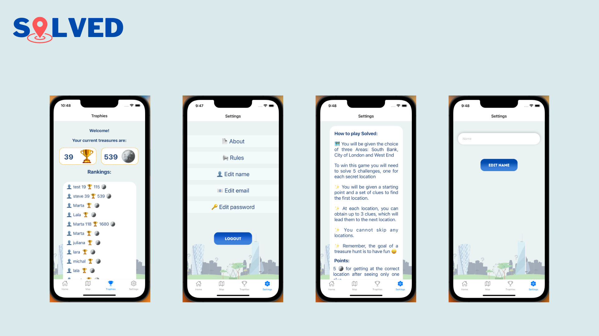

<!-- The title of the project
What the project is/what it does -->
<!-- How to install it (what to clone, what to run to get all dependencies)
How to run it (is it a command line tool? Do you have to load it into IRB? Is it a web application? What port needs to be used?)
How to run the tests


Configuration instructions
A file manifest (list of files included)
Copyright and licensing information
Contact information for the distributor or programmer
Known bugs
Troubleshooting
Credits and acknowledgements
A changelog (usually for programmers)
A news section (usually for users) -->

# Solved - The Mystery Walks App


This mobile app was created as final project by team of 5 junior software engineers at [Makers Academy](https://makers.tech/):

[David Scott](https://github.com/sirdavy),
[Juliana Nocchi](https://github.com/junocchi),
[Marta Bianchini](https://github.com/MartaBia),
[Michal Smyk](https://github.com/MichalSmyk),
[Orhan Khanbay](https://github.com/orhankhanbayov)

We didn't just stumble upon the idea for this app by accident. It all started with maps... but ended up being so much more !

Check out our:

🚀 [Demo]()

🚀 [Presentation](https://drive.google.com/file/d/1WXGYuqBnRJGck4d0YvFUk2NJafbDZ2mq/view?usp=sharing)

🚀 Screens examples:




## About the App

Solved is a live-action treasure hunting game that leads you on an exciting tour of a city neighbourhood. In each Solved treasure hunt you will use your knowledge of the city to search for five secret landmarks. During your adventure you’ll win coins, get recommendations for local cafes and restaurants and learn some amazing facts!
      


## Getting started 

To run the app you will need:
- Node.js
- XCode Developer Tools (iOS simulator)
- Android Studio (android emulator)

### Node.js

💻 You will need Node.js on your machine. If you don't have it you can istall it using this command line in your terminal with brew for macOS.

```
$ brew install node
```
Or on Windows machine, go to [Node.js](https://nodejs.org/en/) website and follow instructions 

The following guidance shows how to use NPM to setup and manage a JavaScript project and it's dependencies. 

If you don't have NVM ( Node Version Manager) on your machine [click here](https://github.com/nvm-sh/nvm#installing-and-updating) to install it.

```
# Setup your enviroment to use the latest version 

$ nvm use node

# Initialize the NPM project

$ npm init -y

# Add jest package 

$ npm add jest

# Install jest 'globally'

$npm install -g jest 

```

### XCode Developer Tools

💻 Install [XCode Developer Tools](https://apps.apple.com/us/app/xcode/id497799835?mt=12)


### Android Studio
💻 Install [Android Studio](https://developer.android.com/studio#:~:text=Android%20Studio%20can%20be%20installed,in%20a%20few%20simple%20clicks.)

After Android Studio installation is completed, you will need to adjust the SDK settings:

Settings --> System Settings --> Android SDK --> go to the tab "DSK Platforms" and one at the time, click to download:

- Android SDK Build-Tools 34-rc1
- Android TiramisuPrivacySandbox Preview

Then, go to the tab "DSK Tools" and one at the time, click to download:

- Android SDK Build-Tools 34-rc1
- Android SDK Command-line Tools

Then, follow the instructions (steps 5 to 8), from [Android Studio Emulator](https://docs.expo.dev/workflow/android-studio-emulator/)


### Google API
<!-- Orhan can you say that features have to be enabled in google API key  -->

First step to getting an API (or starting any project using google ‘stuff’) is setting up an account [here](https://console.cloud.google.com/google/maps-apis/discover?utm_source=Docs_GS_Button&ref=https:%2F%2Fdevelopers.google.com%2Fmaps%2F&pli=1).

You need to enter a bank card even with a free-use plan.

Once signed up it creates a generic/default starter project and generates an API key. But you can select ‘new project’ and it will give you another key specific to that one.

### TripAdvisor

To get TripAdvisor API key go to [developer page](https://www.tripadvisor.com/developers) and create you API key.

<!-- TODO -->
Upload your apis in .env file ( we need to say how they have to name them based on what we have in code base)

## Usage
<!-- mention any scripts -->
<!-- (is it a command line tool? Do you have to load it into IRB? Is it a web application? What port needs to be used?) -->


Navigate to api directory: 
```
$ cd api 

$ npm install
```
Then 

```
$ cd ../frontend

$ npm install
```

Then to run the server, in frontend directory :

```
$ npx expo start
```
Once expo server is running and you have Xcode and Android simulator installed press `i` for iOS simulator and `a` for Android simulator. 

You can also see the app on your iOS/Android phone. 
To do that you will need Expo Go app. After downloading the app on your phone you can scan QR code that will be displayed when you run ``` npx expo start ``` in your terminal


## Running tests

To run the tests, run this command line in main directory: 
```
$ jest
```

## Technologies

MERN stack with React Native

| Technology  | | |
| ----------- | - | ------------------ |
| **MongoDB Atlas**| <code></code>   |
| **Express**      | <code></code> |
| **React Native**          | <code></code>  |
| **Node.js**          | <code></code>  |
| **JavaSript**          | <code></code>  |
| **CSS**          | <code></code>  |

